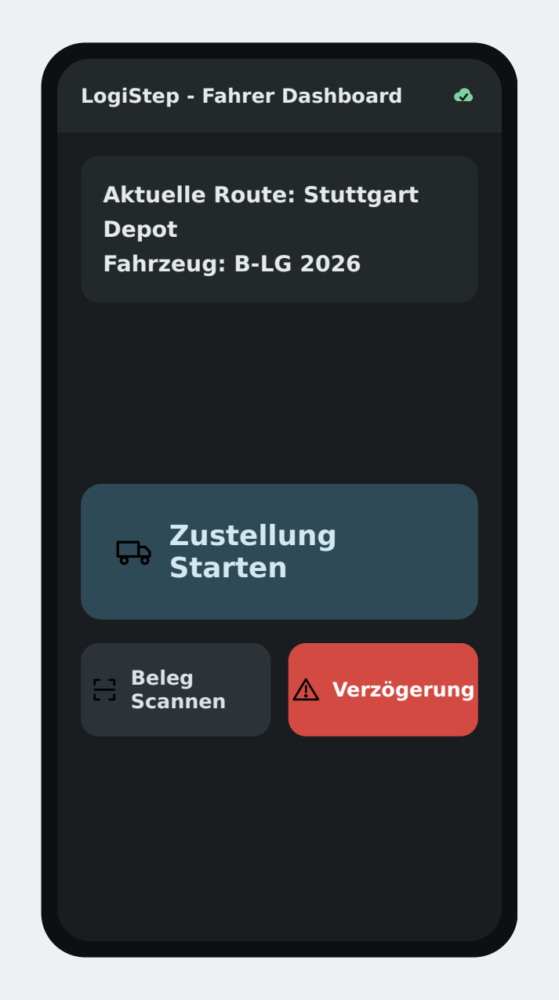
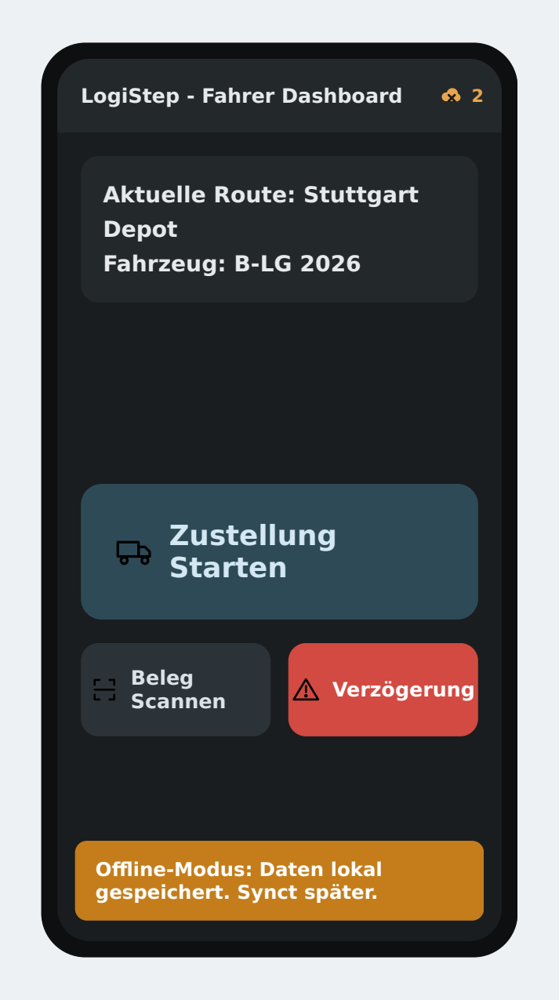
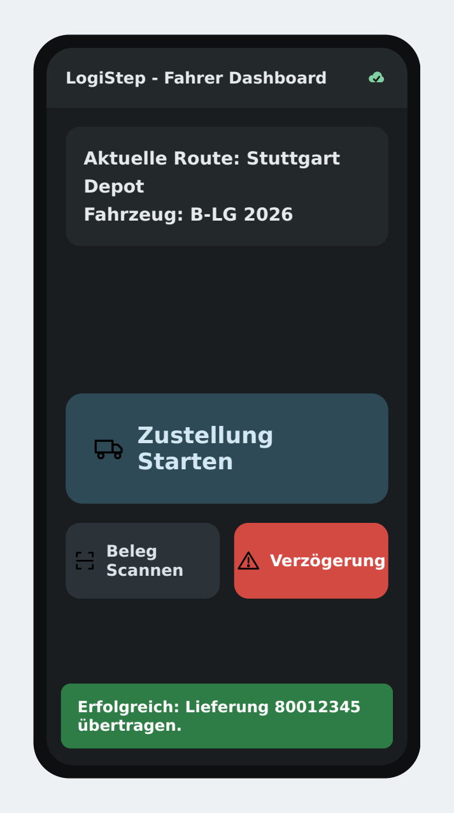

# LogiStep — Intelligent Logistics Integration Ecosystem

LogiStep is a full-stack, cross-platform architecture that synchronizes the
physical logistics world (drivers in the field) with central enterprise systems
(SAP ERP) in real time. It digitizes the delivery-note process, eliminates manual
data entry, and enforces basic network-security compliance.

This repository is a **proof-of-concept** demonstrating the end-to-end data flow:
from the driver's phone, through a Python API gateway, into SAP — with offline
resilience and a network security check.

---

## Screenshots

<p align="center">
  
  &nbsp;&nbsp;
  
  &nbsp;&nbsp;
  
</p>

<p align="center"><em>Driver dashboard &nbsp;·&nbsp; Offline-first queue (data kept locally) &nbsp;·&nbsp; Successful sync to SAP</em></p>

---

## Architecture

```
 ┌─────────────────────┐      HTTP/JSON       ┌──────────────────────┐      RFC/BAPI      ┌───────────┐
 │  Flutter Mobile App │  ───────────────────▶ │  FastAPI Gateway     │  ────────────────▶ │  SAP ERP  │
 │  (main.dart)        │   POST /delivery/sync │  (api_gateway.py)    │                    │           │
 │                     │ ◀─────────────────── │           │          │                    └───────────┘
 │  Offline queue via  │      JSON result     │           ▼          │
 │  shared_preferences │                      │  sap_middleware.py   │ ──▶ Excel Compliance Report
 └─────────────────────┘                      └──────────────────────┘

         ┌──────────────────────────────────────────────┐
         │  Java Security Shield (SecurityScanner.java)   │  Multi-threaded port check
         │  Verifies that only authorized SAP/HTTPS ports │  for network compliance
         └──────────────────────────────────────────────┘
```

## Tech Stack

| Layer | Technologies |
|-------|--------------|
| Mobile Frontend | Flutter, Dart, Material 3, `http`, `shared_preferences` |
| Backend & Integration | Python 3, FastAPI, Uvicorn, Pydantic, `pyrfc` (optional), `openpyxl`, `python-dotenv` |
| Network Security | Java, Socket programming, `ExecutorService` (multi-threading) |

## Project Structure

```
LogiStep/
├── backend/
│   ├── api_gateway.py        # FastAPI bridge (mobile <-> SAP)
│   ├── sap_middleware.py     # SAP BAPI integration + Excel reporting
│   ├── requirements.txt
│   └── .env.example
├── mobile/
│   ├── lib/main.dart         # Driver dashboard (Glance & Go) + offline sync
│   └── pubspec.yaml
├── security/
│   └── SecurityScanner.java  # Multi-threaded port/compliance scanner
├── .gitignore
└── README.md
```

---

## Getting Started

### 1. Backend (FastAPI + SAP middleware)

```bash
cd backend
pip install -r requirements.txt
cp .env.example .env          # fill in SAP credentials (optional)
uvicorn api_gateway:app --host 0.0.0.0 --port 8000
```

> **Simulation mode:** If `pyrfc` is not installed or the SAP credentials are
> empty, the middleware automatically runs in **simulation mode**, so the entire
> stack works without a live SAP system. Every transaction is still logged to
> `Delivery_Compliance_Report.xlsx`.

Quick test:

```bash
curl -X POST http://localhost:8000/api/v1/delivery/sync \
  -H "Content-Type: application/json" \
  -d '{"delivery_id":"80012345","driver_id":"DRV_HANS_01","status_code":"DELIVERED","gps_location":"48.6606, 8.9366"}'
```

### 2. Mobile (Flutter)

```bash
cd mobile
flutter pub get
flutter run
```

- On the Android emulator the backend is reached at `http://10.0.2.2:8000`
  (already configured in `main.dart`). On a physical device, change
  `kApiBaseUrl` to your server's LAN IP.
- Tap **"Beleg Scannen"** to send a delivery. If the server is unreachable, the
  payload is stored locally via `shared_preferences` and automatically re-synced
  on the next successful connection. The app bar icon reflects pending items.

### 3. Security Shield (Java)

```bash
cd security
javac SecurityScanner.java
java SecurityScanner 127.0.0.1   # or your SAP/server IP
```

Scans a fixed set of authorized ports (443, 3300, 3301, 8443) concurrently and
prints a compliance summary.

---

## Key Features

- **Glance & Go mobile UX** — large thumb-zone actions designed for use while
  driving.
- **Offline-first** — deliveries are never lost on highways; they queue locally
  and sync when connectivity returns.
- **Automated SAP integration** — outbound delivery updates via
  `BAPI_OUTB_DELIVERY_CREATE_STO` with commit/rollback handling.
- **Compliance reporting** — every transaction is timestamped to an Excel report.
- **Network security** — multi-threaded port verification against an allow-list.

---

*Author: Haydar Kozat — IT-Systemadministrator / IT-Projektkoordinator*
